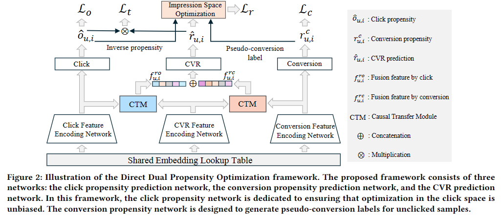

## DDPO: Direct Dual Propensity Optimization for Post-Click Conversion Rate Estimation

Hongzu Su, Lichao Meng,  Lei Zhu, Ke Lu, Jingjing Li




Abstract: In online advertising, the sample selection bias problem is a major cause of inaccurate conversion rate estimates. Current mainstream solutions only perform causality-based optimization in the click space since the conversion labels in the non-click space are absent. However, optimization for unclicked samples is equally essential because the non-click space contains more samples and user characteristics than the click space. To exploit the unclicked samples, we propose a Direct Dual Propensity Optimization (DDPO) framework to optimize the model directly in impression space with both clicked and unclicked samples. In this framework, we specifically design a click propensity network and a conversion propensity network. The click propensity network is dedicated to ensuring that optimization in the click space is unbiased. The conversion propensity network is designed to generate pseudo-conversion labels for unclicked samples, thus overcoming the challenge of absent labels in non-click space. With these two propensity networks, we are able to perform causality-based optimization in both click space and non-click space. In addition, to strengthen the causal relationship, we design two causal transfer modules for the conversion rate prediction model with the attention mechanism. The proposed framework is evaluated on five real-world public datasets and one private Tencent advertising dataset. Experimental results verify that our method is able to improve the prediction performance significantly. For instance, our method outperforms the previous state-of-the-art method by $7.0\%$ in terms of the Area Under the Curve on the Ali-CCP dataset.

## Datasets

The processed Ali-CCP and Tencent datasets can be downloaded from [Google Drive](https://drive.google.com/drive/folders/1mWuo1Oin8yCf_-Xq8c8IqjslXccNp0dl?usp=drive_link).

The AliExpress dataset can be download from [MTReclib](https://github.com/easezyc/Multitask-Recommendation-Library).

You can put the downloaded datasets in `./data/`.

## Requirements

* Python 3.6
* PyTorch > 1.10
* pandas
* numpy
* tqdm

You can create the environment with conda：
```
conda env create -f environments.yml
```

## Run

You can run the training code:

```bash
python main.py --model_name ddpo --dataset_name [ccp|industrial|AliExpress_NL|AliExpress_ES|AliExpress_US|AliExpress_FR]
```

## Acknowledgement

The structure of this code is largely based on [MTReclib](https://github.com/easezyc/Multitask-Recommendation-Library). Thanks for their excellent work!
